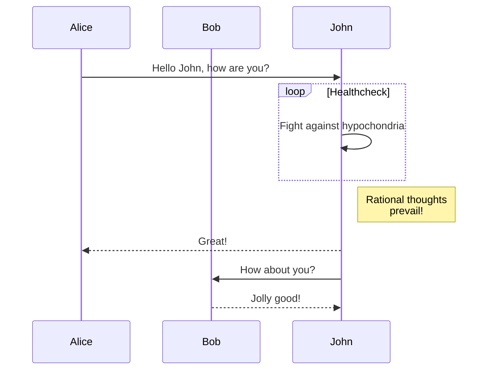

# 🛠️ Internal Tools

This page lists helpful tools for the team.

| Tool Name    | Description            | Link                          |
|--------------|------------------------|-------------------------------|
| Time Tracker | Logs project hours     | [Go to Tool](/tools/time)     |
| Wiki         | Internal documentation | [Go to Wiki](/tools/wiki)     |

This is the first paragraph.

<!--more-->

This is the second paragraph.
